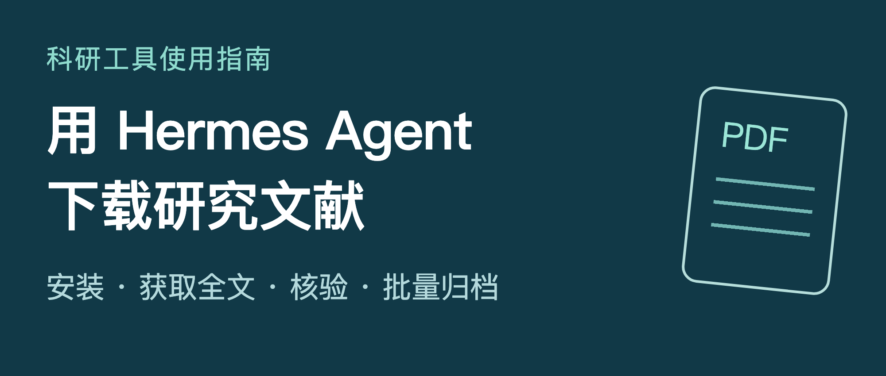

# Hermes Agent 文献下载图文教程

中文科研工具使用指南。从打开终端和模型配置开始，完成公开论文下载、医学全文获取、清单去重、核验归档及未完成项续做。

**当前版本：v3.0.0 精简图文与手机版，2026-10-02。Word 与 PDF 均为 20 页。**



## 阅读与下载

- [手机阅读版](https://yonglee1979-ai.github.io/hermes-literature-download-guide/mobile.html)：与发表稿正文一致，目录跳转、图片放大、任务复制。
- [公众号排版页](https://yonglee1979-ai.github.io/hermes-literature-download-guide/)：电脑打开后复制正文，粘贴到公众号编辑器。
- [PDF 20 页](downloads/hermes-wechat-guide.pdf) 与 [可编辑 Word](downloads/hermes-wechat-guide.docx)。
- [手机 EPUB](downloads/hermes-mobile-reader.epub)：可导入支持 EPUB 的阅读器，按设备调整字号。
- [离线手机 HTML](downloads/hermes-mobile-reader.html)：图片内嵌，下载后用浏览器打开；剪贴板支持因系统而异。
- [完整素材包](downloads/hermes-wechat-package.zip)：正文、手机版、电子书、高清图片、编辑图稿、提示词和 CSV。
- [公众号发表操作指南](https://yonglee1979-ai.github.io/hermes-literature-download-guide/wechat/公众号发表操作指南.html)：导入、补图、封面和手机预览。
- [Markdown 正文](wechat/Hermes文献下载_公众号发表稿.md) 与 [内嵌图片的公众号排版 HTML](wechat/Hermes文献下载_公众号排版稿.html)。

## 这一版包含什么

- 12 节正文，约 4000 个汉字，保留安装、认证、工具、路径、环境检查、单篇与批量操作。
- 1 张封面、16 张关键操作图；7 张补充图和 4 张发表指南图另附素材包，共 28 张高清 PNG。
- 9 组可复制任务模板，三条输入对应两篇文献的 CSV 练习、教学去重映射和空白记录模板。
- Word、PDF、Markdown、公众号 HTML、手机 HTML、EPUB 和 ZIP。
- arXiv 官方页面局部真实截图；其余明确标为指令卡、题录卡或流程图。
- 按当前官方文档说明 PMC 2026 年分发服务调整后的自动获取路线。

## 跟着操作

1. 第 02 至 04 节：在电脑终端完成安装和配置，进入专用工作目录后启动 Hermes。
2. 第 05 节：发送环境检查任务，实际验证工具调用、网页访问与文件回读。
3. 第 06 节：获取 arXiv:1706.03762；自己打开全文，核对清单。
4. 第 07 至 08 节：练习 PMID 获取和 [papers.csv](wechat/papers.csv) 去重，最多五篇为第一小批。
5. 第 10 至 11 节：核验文件、记录版本和失败原因，按清单继续未完成项。

## 文件结构与版本

```text
index.html                       公众号在线排版页
mobile.html                      当前手机阅读页
wechat/                          v3.0.0 正文与素材
  images/                        28 张 PNG
  figures/                       28 份可编辑 HTML/CSS 图稿
  配图索引.csv                    正文图1至图16、发表图P1至P4与补充图
  papers.csv                     三条数据记录的练习清单
downloads/hermes-wechat-*         Word、20页PDF、完整ZIP
downloads/hermes-mobile-reader.*  离线手机HTML与EPUB
docs/guide.md                    v1.0.0 历史稿，已标明版本
images/ 和 figures/              v1.0.0 历史素材
CHECKSUMS.sha256                  文件校验清单
```

v1.0.0、v2.0.0 Release 保留，当前在线页与下载目录使用 v3.0.0。补充图与正文图按配图索引区分，发表正文无需插入全部素材。

## 来源与验证范围

见 [来源与核验说明](wechat/来源与核验说明.md)。命令和功能依据官方来源核对，正文图8为真实页面局部截图。任务模板未在本机运行 Hermes 论文下载，实际结果需要在读者环境验收。

已逐页检查 20 页 Word/PDF，检查图片与 CSV，验证手机 320、390、430 像素宽度、目录、放大和复制功能。EPUB 检查 XML、资源完整性及浏览器中的正文预览；具体阅读器显示以设备为准。公开发布后核对仓库文件、网站和下载包的一致性。

本教程为独立创作，不代表 Nous Research 官方发布。素材不含论文全文、私人资料、账号配置、凭据或个人本机路径。未登录或发表到用户公众号，发表步骤以实际后台为准。
