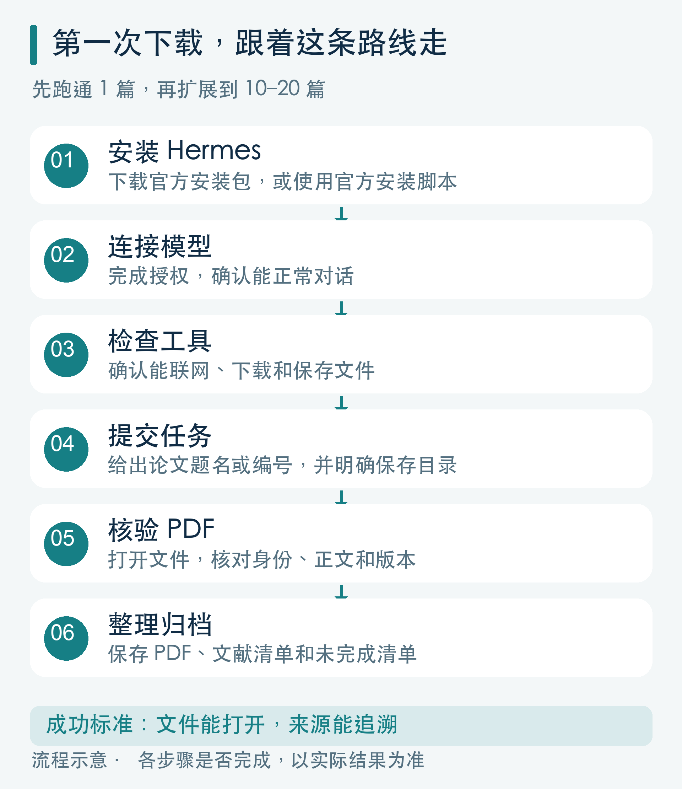
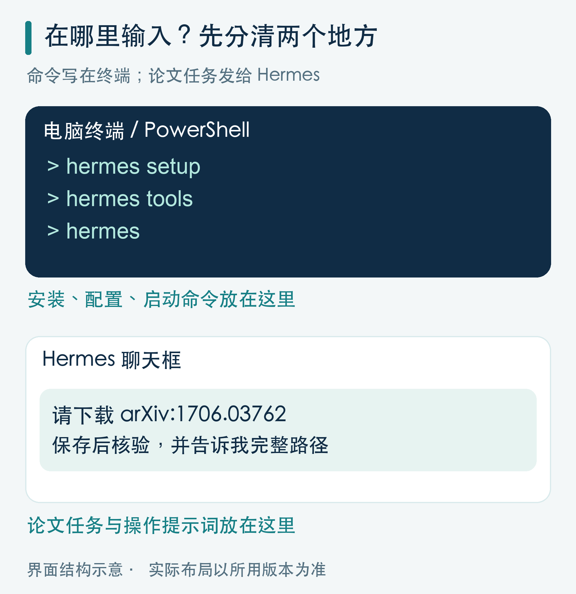
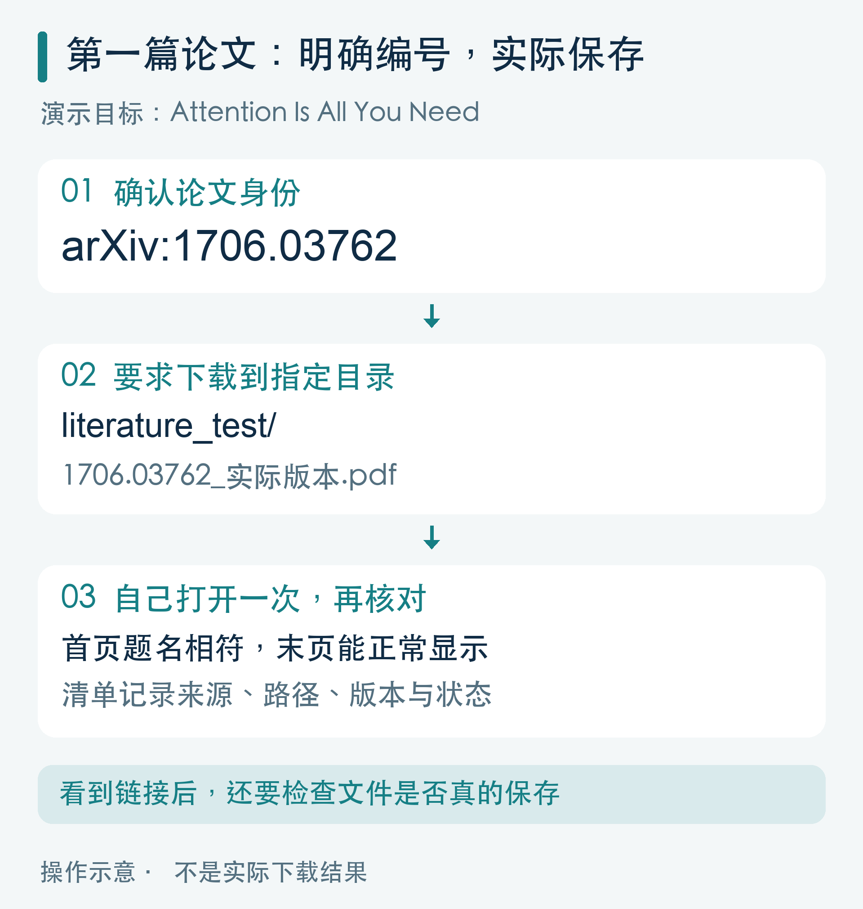
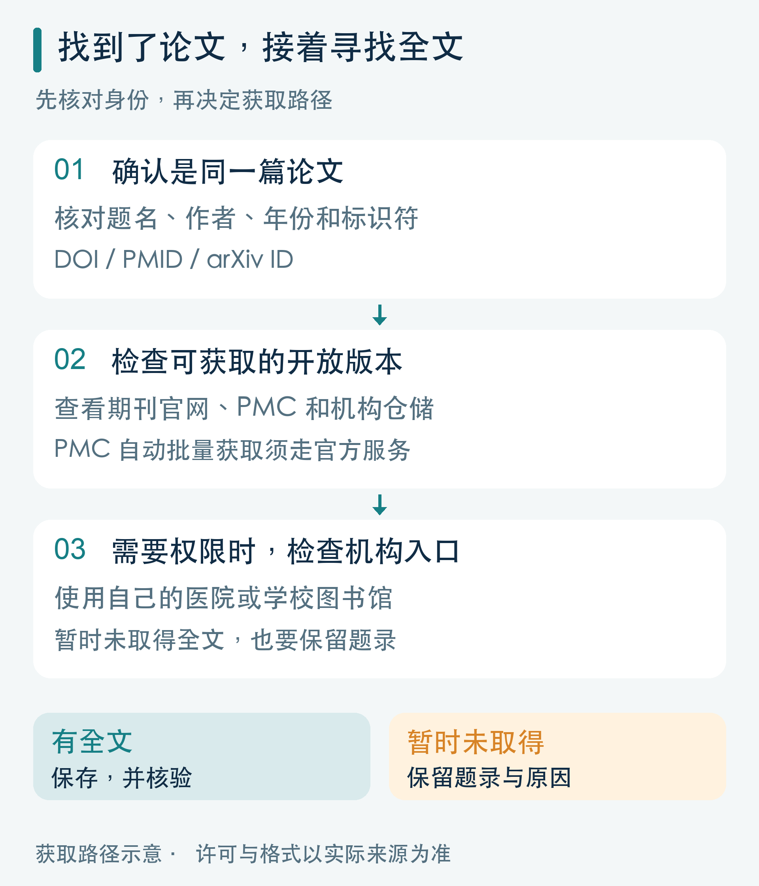
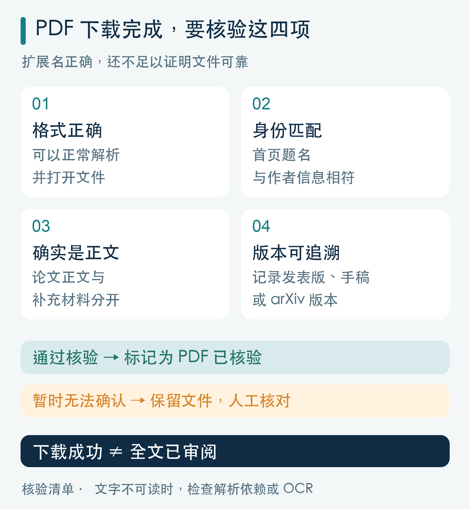
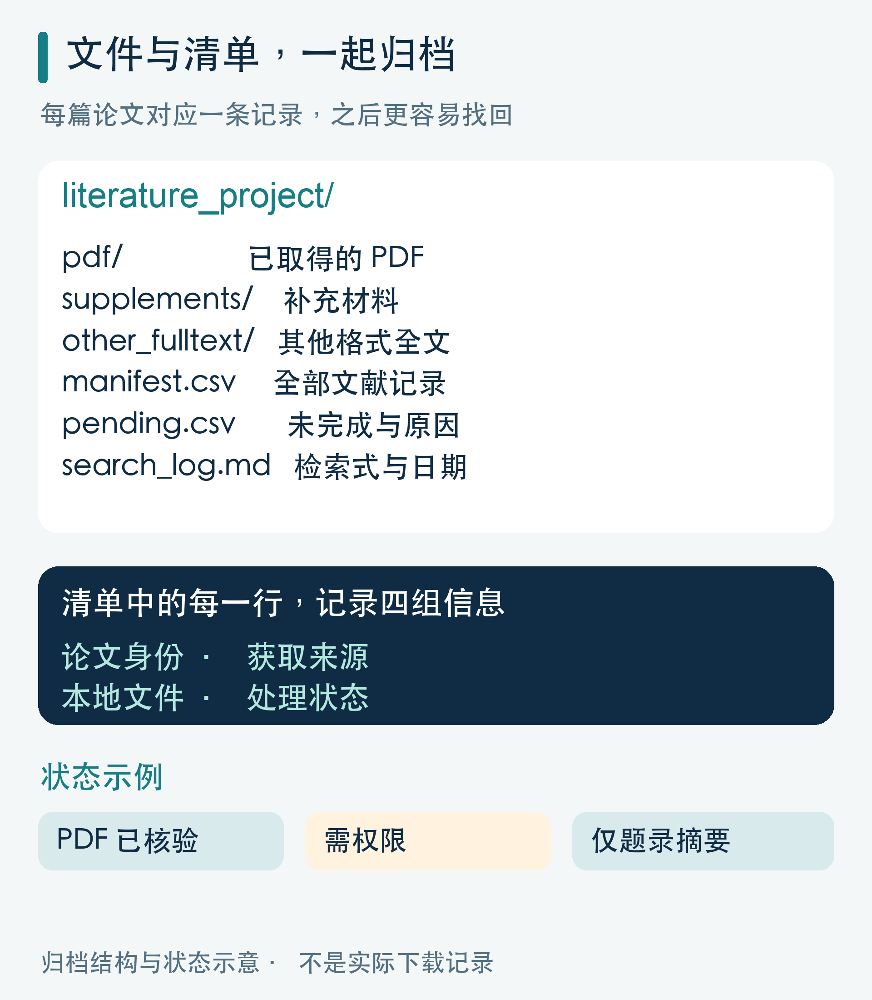
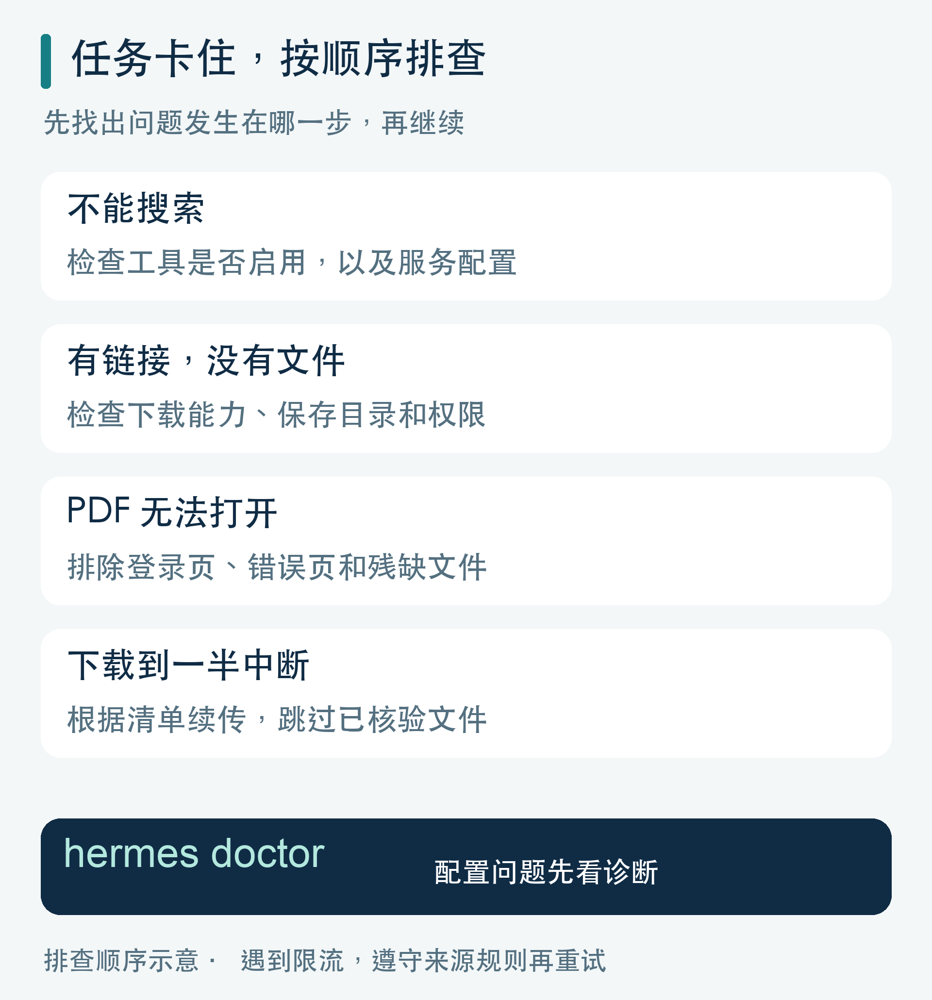

# 用 Hermes Agent 下载研究文献：从第一篇 PDF 到批量归档的完整攻略


**找文献、下全文、改文件名、整理引用，这些重复工作，可以交给 AI 助手串起来做。**

准备课题、写综述或制作学术报告时，你可能遇到过这样的场景：论文已经找到了，全文却散落在期刊网站、开放仓储和电脑下载文件夹里；过几天再看，又分不清哪个是正式发表版，哪个是作者手稿。

Hermes Agent 可以帮助我们把这段流程连接起来：检索论文，寻找可获取的全文，把文件保存到指定目录，再整理成可追溯的文献清单。

这篇文章从安装和首次下载讲起，提供单篇获取、清单下载、主题检索三种操作方式，以及可以直接复制给 Hermes 的提示词。

*适用工具：Nous Research 的 Hermes Agent。官方文档核对日期：2026 年 10 月 1 日。提示词为工作流模板，实际执行取决于版本、模型、工具配置和文献访问权限。*

**怎样跟着操作：** 先看总流程，再从第二节开始逐步执行。本文的安装与配置命令输入电脑终端或 PowerShell；以“请……”开头的任务提示词输入 Hermes 聊天框。每一步完成后，对照“应该看到的结果”检查，再进入下一步。

**配图说明：** 封面为 AI 插画；正文七张图均为流程或界面结构示意，不是 Hermes 实际截图或真实下载记录。



*图1｜先用一篇论文跑通整条路线，再增加批量。*

## 一、开始之前，先明确要交付什么

Hermes Agent 具备网页搜索、浏览器操作、终端执行和文件读写能力。这些能力可以组合成文献获取流程，但仍需要配置可用的模型和工具。[官方工具说明](https://hermes-agent.nousresearch.com/docs/user-guide/features/tools/)

建议把一次任务的交付物设为三个：

- **全文文件夹**：保存已取得的 PDF，或明确标注格式的其他全文。
- **文献清单**：记录题名、作者、标识符、来源和本地文件位置。
- **未完成清单**：记录哪些文献需要权限、哪些下载失败、哪些只有摘要。

验收时，重点看文件和清单能否对应。找到一个链接、网页上读到摘要，都不能算作“PDF 已下载”。

全文来源也要分清：

| 入口 | 适合承担的工作 |
| --- | --- |
| arXiv | 查找相关领域论文，获取对应版本 |
| PubMed | 检索医学文献，核对题录和全文入口 |
| PMC | 查找医学全文，按许可和官方服务获取 |
| 期刊官网、机构仓储 | 查找发表版或作者手稿 |
| 医院、学校图书馆 | 获取机构订阅范围内的文献 |

其中，PubMed 的检索结果主要是题录和摘要；全文通常来自 PMC、出版社或其他外部来源。机构订阅也是一种获取途径。[PubMed 全文获取说明](https://pubmed.ncbi.nlm.nih.gov/help/#finding-the-full-text-article)

## 二、安装 Hermes，并检查三个条件



*图2｜安装和配置用终端；下载任务与提示词发给 Hermes。图中界面为结构示意。*

### 1. 选择安装方式

不熟悉终端的读者，可以先到 [Hermes 官网](https://hermes-agent.nousresearch.com/) 选择桌面安装包。下载前核对电脑系统、处理器和安装包要求；不同安装方式的支持范围并不完全相同。[平台支持说明](https://hermes-agent.nousresearch.com/docs/getting-started/platform-support)

如果使用命令行，官方提供以下安装方式。命令应输入电脑的终端或 PowerShell。

**macOS、Linux、WSL2：** 

```bash
curl -fsSL https://hermes-agent.nousresearch.com/install.sh | bash
```

**Windows 原生 PowerShell：** 

```powershell
iex (irm https://hermes-agent.nousresearch.com/install.ps1)
```

安装后重新打开终端，再进行配置。[官方安装指南](https://hermes-agent.nousresearch.com/docs/getting-started/installation)

### 2. 配置模型

在终端输入：

```bash
hermes setup
```

按照向导选择模型服务并完成授权。已有配置、只想调整模型时，可以使用：

```bash
hermes model
```

如果选择 Nous Portal，可以按官方说明使用 `hermes setup --portal`。模型和配套工具的额度、计费，以实际服务方案为准。[官方快速入门](https://hermes-agent.nousresearch.com/docs/getting-started/quickstart)

### 3. 检查工具和保存位置

在终端输入：

```bash
hermes tools
```

确认网页搜索、终端和文件操作可用；需要点击页面或处理动态网站时，再启用浏览器。网页搜索的服务选择和相关配置，也可以在这里完成。[网页搜索配置说明](https://hermes-agent.nousresearch.com/docs/user-guide/features/web-search)

然后打开 Hermes 桌面聊天，或在终端输入 `hermes`，发送：

> 请检查你是否能完成文献获取任务：  
> 1. 报告当前模型、网页搜索、终端和文件读写是否可用。  
> 2. 告诉我你运行在本机、容器还是远程服务器。  
> 3. 在当前工作目录新建 literature_test 文件夹，写入一个测试文本并重新读取。  
> 4. 返回该文件的完整路径；如果文件在远程环境，说明我怎样取回。  
> 5. 只操作新建的测试文件夹。

这一步确认三个条件：** 能对话、能联网、能保存并重新读取文件。**

**照做后应该看到：** Hermes 报告工具可用情况，返回测试文件的完整路径，并能重新读出刚才写入的内容。若文件在远程环境，它还应说明取回方法。

如果使用云端或远程环境，文件可能保存在服务器上。请先弄清下载到哪里，再开始批量任务。

## 三、第一次操作：先下载一篇确定的论文

首次练习建议使用有明确标识符和全文入口的论文。例如，arXiv 上的《Attention Is All You Need》，编号为 **1706.03762**。[论文页面](https://arxiv.org/abs/1706.03762)



*图3｜给出明确编号，要求实际保存，再自己打开核对。图中路径为操作示例。*

把下面整段复制到 Hermes 聊天框：

> 请获取 arXiv:1706.03762，题名应为 Attention Is All You Need。  
>   
> 先确认当前工作目录和可写位置，在其中建立 literature_test。  
> 从 arXiv 官方页面核对题名、作者和当前版本，获取 PDF。  
> 使用终端下载能力把 PDF 实际保存到 literature_test；仅提取网页文字不算下载完成。  
> 文件名包含 arXiv 编号和实际版本号。  
> 保存后检查文件是否为可解析的 PDF，并核对首页题名。  
> 写入 manifest.csv，记录编号、题名、版本、来源链接、本地路径、文件大小、页数和核验状态。  
> 最后报告文件完整路径及核验结果；失败时说明原因，不要标记为成功。

运行后，自己打开一次文件，确认首页和末页能正常显示。

**照做后应该看到：** 目标目录中出现论文 PDF 和 manifest.csv。打开 PDF 后，首页题名与目标相符；清单能够找到这份文件的来源、路径、版本与核验状态。

**没有看到这些结果时：** 直接告诉 Hermes 缺少哪一项，让它继续定位问题。不要仅凭一句“已完成”进入批量任务。

**这一篇跑通之后，再扩展到十篇或二十篇。** 这样更容易分辨问题出在网络、权限、下载还是文件保存环节。

### 找到 PDF 链接后，为什么仍可能下不下来？

浏览网页和保存文件属于不同能力。官方浏览器文档列出了文件下载限制，因此不能假定所有浏览器后端都能直接把 PDF 保存下来。[浏览器操作说明](https://hermes-agent.nousresearch.com/docs/user-guide/features/browser)

可以继续告诉 Hermes：

> 你已经找到全文入口。请检查当前浏览器后端是否支持文件下载。  
> 对允许直接获取的 PDF，使用终端下载工具保存到指定目录。  
> 如果请求依赖登录状态或下载权限，说明缺少什么条件，保留记录，不要反复请求。

### arXiv 技能是否必须安装？

可以先查看已有技能：

```bash
hermes skills list
```

如果没有 arXiv 技能，官方指南提供了安装命令：

```bash
hermes skills install official/research/arxiv
```

安装后开启新会话，让技能生效。[技能使用指南](https://hermes-agent.nousresearch.com/docs/guides/work-with-skills)

官方 arXiv 技能支持按关键词、作者、分类或编号检索论文。**使用检索技能后，仍要明确要求把文件保存并核验。**[官方 arXiv 技能](https://github.com/NousResearch/hermes-agent/blob/main/skills/research/arxiv/SKILL.md)

## 四、已有题名、DOI 或 PMID，怎样获取全文？



*图4｜先核对论文身份，再检查开放版本和机构获取入口。*

如果已经拿到导师推荐清单或文章参考文献，优先使用明确标识符定位论文，再核对题名、作者和年份。

可以直接发送：

> 请定位并获取下面这篇论文的全文：  
> 题名：【填写题名】  
> DOI 或 PMID：【如有则填写】  
> 作者、年份：【可选】  
> 保存目录：【填写你希望使用的目录】  
>   
> 先核对论文身份，再寻找期刊官网、开放仓储或其他已授权来源。  
> 如果有多个版本，记录各自版本信息，优先获取与我的用途相符的版本。  
> 取得 PDF 后保存并核验；如果只有 HTML 全文，单独记录格式。  
> 如果没有获取到全文，保留题录、来源链接和失败原因。  
> 无法核实的字段留空，不要补写 DOI 或页码。

按 DOI 寻找开放版本时，也可以让 Hermes 查询 Unpaywall 的开放获取位置，并区分链接指向 PDF 还是文章页面。[Unpaywall 数据格式说明](https://unpaywall.org/data-format)

如果全文需要机构权限，先通过自己的图书馆入口处理登录或下载。把已获取的文件交给 Hermes，后续仍可继续核验和归档。

### 批量清单怎么交给 Hermes？

准备一个表格，尽量包含：

```text
title,doi,pmid,year
```

字段可以不齐全，但每行至少提供一个能定位论文的信息。

**第一次练习：** 资料包提供 papers_example.csv，用前面同一篇 arXiv 论文演示清单输入。把文件放入 Hermes 的工作目录，先要求它报告文件行数并核对题录；下面的提示词把 papers.csv 替换为 papers_example.csv 即可。之后，再换成你自己的文献清单。

字段可以不齐全，但每行至少提供一个能定位论文的信息。把文件放入工作目录，复制下面的提示词，并替换文件名：

> 请读取当前目录中的 papers.csv，先核对题录并去重，再尝试获取全文。  
> 优先按 DOI 或 PMID 识别重复条目；缺少标识符时，结合题名、作者和年份核对。  
> 不要把同一研究的不同论文直接合并；预印本与发表版记录关联关系。  
> 第一批处理最多 20 篇，遵守各来源的访问规则。  
> 保存到 literature_batch/pdf，并逐篇核验。  
> 全部条目写入 manifest.csv；未取得全文的条目另列 pending.csv，说明原因。  
> 本轮只请求全文获取和归档，不生成研究结论。  
> 最后核对输入条数、重复条数、实际处理条数、成功数和待处理数。

**照做后应该看到：** manifest.csv 中保留全部输入记录和处理状态，实际取得的 PDF 能与清单对应。未取得全文的记录出现在 pending.csv，且说明具体原因。

## 五、只有研究主题，怎样检索并下载？

“帮我找一些相关文献”很难得到稳定结果。更有效的任务描述，要说清楚：

**研究问题、时间范围、研究类型、数据库和本轮数量。**

以再生障碍性贫血领域为例，可以先让 Hermes 制定检索方案：

> 我要收集 2019 年 1 月 1 日至 2026 年 10 月 1 日，关于艾曲泊帕用于获得性再生障碍性贫血的临床研究。  
> 优先检索 PubMed，区分初治与难治患者、成人与儿童、单药与联合治疗。  
> 研究类型优先随机对照试验和前瞻性研究，综述单独列出。  
> 请先给出检索式和筛选标准，并说明是否需要补充主题词、同义词或其他数据库。  
> 此轮只制定方案，不下载文件。

核对方案后，再发送：

> 请按刚才的方案执行检索，先提供最多 20 篇候选文献。  
> 每篇列出题名、年份、研究类型、相关人群、DOI/PMID、来源链接和纳入理由。  
> 元数据核验与初筛完成后，尝试获取可下载全文，并记录获取状态。  
> 保存实际检索式、检索日期和筛选理由。  
> 没有取得全文的文献仍保留在清单中。

日常选题或备课可以先做小批量检索。正式系统综述需要覆盖完整检索范围、记录筛选过程；“优先找 20 篇”只能作为起步任务。

也不要因为某篇论文暂时无法下载，就把它从候选证据中删除。

## 六、医学文献批量获取，特别注意 PMC 的入口

PMC 可以在线阅读全文，但不同文章的许可和可获取格式有所差别。批量自动获取应使用官方允许的服务，并核对文章许可。

目前 PMC 开发者文档列出的自动获取途径包括 Cloud Service、OAI-PMH、E-Utilities 和 BioC API；不能把逐页抓取 PMC 网页当作批量全文下载方案。[PMC 开发者说明](https://pmc.ncbi.nlm.nih.gov/tools/developers/)

截至本文核对日期，PMC 文献数据集分发服务已完成调整，旧版 FTP 和云端数据集文件已被移除。遇到旧教程中的路径失效，应查看当前的 Cloud Service 文档。[PMC 当前数据集获取说明](https://pmc.ncbi.nlm.nih.gov/tools/pmcaws/)

可以把这段要求加入医学下载任务：

> 涉及 PMC 内容时，请先查看当前官方开发者和数据集文档，使用允许的自动获取服务。  
> 核对许可、版本和可获取格式，不逐页批量抓取网站。  
> 如果取得的是 XML 或其他全文格式，按真实格式保存，不改后缀伪装成 PDF。  
> 如果当前服务不提供所需 PDF，记录状态和人工获取入口。

arXiv 也有接口访问限制：其传统 API 要求单连接，请求间隔至少三秒。让 Hermes 按来源规则控制请求，遇到限流再延迟重试。[arXiv API 使用条款](https://info.arxiv.org/help/api/tou.html)

## 七、下载完成后，怎样判断文件可靠？



*图5｜检查格式、身份、正文和版本，确认文件能用于后续阅读。*

一个文件名以 `.pdf` 结尾，并不代表下载成功。登录页、错误页、补充材料，也可能被误存成“论文 PDF”。

建议给 Hermes 增加四项核验：

1. **格式正确**：检查实际文件内容，确认可以作为 PDF 解析。
2. **身份匹配**：核对首页题名、作者及可获得的标识符。
3. **正文匹配**：确认是目标论文正文，补充材料单独保存。
4. **版本可追溯**：记录发表版、作者手稿或 arXiv 版本等信息。

可以发送：

> 请核验 literature_batch/pdf 中的全部文件，并更新 manifest.csv。  
> 检查格式、页数、题名匹配、正文与补充材料、版本信息和重复文件。  
> 不要只凭扩展名、文件大小或 HTTP 成功状态判断下载完成。  
> 将结果标为“PDF 已保存并核验”“PDF 已保存待人工核验”或“文件异常”。  
> 暂时无法读取文字的 PDF 单独标记，并说明可能的原因。  
> 保留异常文件及记录，不要覆盖正常文件。

遇到扫描版，文字提取可能为空。Hermes 的文档提取说明指出，扫描页需要进一步通过页面图像或 OCR 处理；解析依赖不可用时，也可能无法读取 PDF。[文档提取说明](https://hermes-agent.nousresearch.com/docs/user-guide/features/document-extraction)

**下载成功、文字可读和全文已审阅，是三个不同状态。** 只有摘要或部分页面可读时，后续摘要也应说明依据范围。

## 八、让文献文件夹以后仍然找得到、用得上



*图6｜每篇论文对应一条记录，文件和来源一起保存。*

建议让 Hermes 建立这样的目录：

```text
literature_project/
├── pdf/
├── supplements/
├── other_fulltext/
├── manifest.csv
├── pending.csv
├── references.ris
└── search_log.md
```

这是建议的归档结构，可以根据实际需要调整。

文件名建议采用：

**年份_第一作者_简短题名_标识符或版本.pdf**

完整题名放在清单里，文件名避免过长；补充材料增加 `supplement` 标识。

清单至少记录四组信息：

| 信息组 | 建议字段 |
| --- | --- |
| 论文身份 | 题名、作者、年份、期刊、DOI/PMID/arXiv ID |
| 获取来源 | 来源页面、实际下载地址、获取日期 |
| 本地文件 | 路径、格式、版本、文件大小、页数 |
| 处理状态 | 获取状态、核验结果、失败原因 |

建议使用能看出差别的状态：** PDF 已核验、PDF 待核验、其他格式全文、仅题录摘要、需权限、下载失败。**

引用管理方面，可以保留数据库导出的题录。PubMed 支持通过“Send to → Citation Manager”导出 `.nbib` 文件。[PubMed 题录导出说明](https://pubmed.ncbi.nlm.nih.gov/help/#export-citations-into-citation-management-software)

使用 Zotero 时，可以导入受支持的引用文件，也可以通过 DOI、PMID 等标识符添加条目，再关联本地 PDF。[Zotero 官方操作说明](https://www.zotero.org/support/adding_items_to_zotero)

让 Hermes 生成 RIS 或 BibTeX 时，要求它基于核实过的元数据填写，并抽查导入后的题名、作者、年份和 DOI。

## 九、常见问题，照这张表排查



*图7｜从出问题的环节开始检查，已核验文件可以跳过。*

| 遇到的问题 | 下一步 |
| --- | --- |
| Hermes 能聊天，却不能搜索 | 检查网页搜索工具是否启用，以及服务配置是否可用 |
| 找到了全文链接，文件没保存 | 检查下载能力、目标目录和权限，要求返回实际路径 |
| PDF 打不开 | 检查是否误存了登录页、错误页，或文件未下载完整 |
| 显示需要登录或付费 | 保留题录，检查开放版本和机构获取入口 |
| 文件保存了，电脑里找不到 | 确认运行环境，检查容器、服务器或远程工作目录 |
| 批量任务中断 | 根据清单续传，跳过已经保存并核验的条目 |
| PDF 能打开，AI 却读不到 | 检查解析依赖和文字层，必要时进行 OCR |
| 看似下载很多，实际都是同一篇 | 核对 DOI、版本和文件哈希，重新检查去重记录 |

配置问题可在终端运行 `hermes doctor`，根据诊断结果处理。[官方排错说明](https://hermes-agent.nousresearch.com/docs/getting-started/installation#troubleshooting)

第一次使用，就从一篇确定的论文开始：** 定位、保存、打开、核验、记录来源。** 跑通后，再用同一套规则处理文献清单。

当每个文件都有来源、每篇论文都有状态，Hermes 才能帮你减少重复劳动，而这批资料也更容易被用于后续阅读、写作和学术报告。

