# 用 Hermes Agent 下载研究文献：从第一篇 PDF 到文献库


找到了论文题名，接下来还有核对身份、寻找全文、保存文件、记录来源等工作。几篇可以手动整理；数量多了，容易出现“下载了文件，却不知道对应哪条文献”的问题。

**Hermes Agent 可以把检索、保存、核验和归档连接起来。任务里同时写明操作要求和完成标准，结果才容易检查。** 本文从打开终端开始，先练习一篇公开论文，再处理医学文献和批量清单。命令从正文复制；以“请……”开头的任务，发到启动后的 Hermes 对话中。

跟做顺序：**安装 → 配置 → 环境检查 → 单篇下载 → 清单处理 → 核验归档。** 新手按第 02 至 06 节完成第一轮；已装好 Hermes，先做第 05 节检查。配套手机版与本稿正文一致，支持分节跳转、复制任务和放大图片。

*适用范围：Nous Research 的 Hermes Agent，本机命令行入门。官方文档核对日期：2026 年 10 月 2 日。操作图为指引；真实页面截图另有标注。*

## 01 先确认你要找的是哪篇论文

Hermes 的模型负责理解任务，网页工具负责找资料，终端和文件工具负责实际保存。本文将这些能力组合成文献流程，并非新增的“论文下载”内置命令。[官方工具说明](https://hermes-agent.nousresearch.com/docs/user-guide/features/tools/)

准确编号比宽泛主题更容易核对：DOI 标识学术作品；PMID 是 PubMed 题录编号；PMCID 是 PMC 全文记录编号；arXiv 编号还可以带版本后缀。**有编号，不等于有可下载的 PDF。**

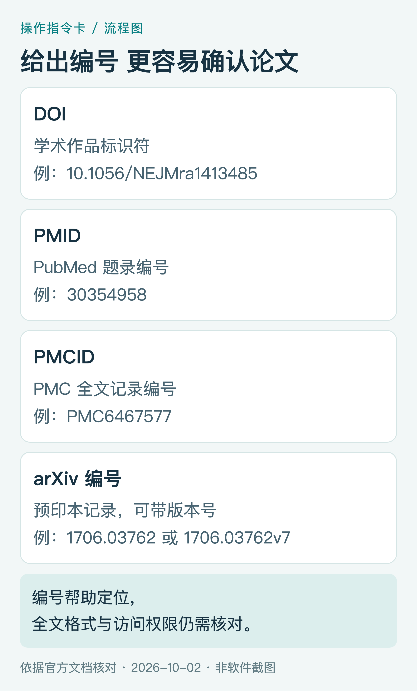

*图1｜标识符对照图，非软件截图。题名、作者、年份与编号应在题录中相互核对。*

只有题名时，同时提供作者或年份；有 DOI、PMID 时保留完整编号。取得全文后，记录来源和实际版本。来源只提供 HTML、XML 或 TXT 时，按真实格式保存，不能改名为 PDF。

## 02 打开终端，分清两种输入位置

macOS 按 `⌘ + 空格`，搜索“终端”并打开；Windows 从开始菜单搜索 PowerShell，或打开 Windows Terminal 的 PowerShell 标签页。

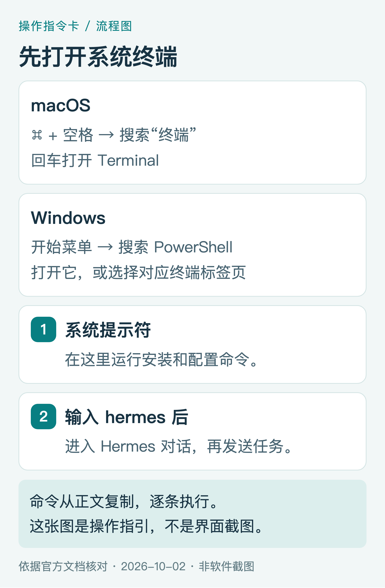

*图2｜系统操作指引，非软件截图。先运行电脑命令，再进入 Hermes 对话。*

**电脑终端**输入安装、配置和启动命令，如 `hermes setup`、`hermes tools`、`hermes`。**Hermes 对话输入区**粘贴自然语言任务，如“请下载这篇论文并保存清单”。一个命令执行完再输入下一个；命令块内没有附加提示符，可以直接复制。

## 03 安装并确认命令可用

准备电脑、网络和一种可在 Hermes 配置的模型服务。模型和部分网页服务可能收费，先用一篇论文练习。

**先核对系统支持。** 当前官方表列出 Apple Silicon macOS、Windows、Linux 支持；Intel macOS 当前不受支持。架构和依赖以[官方平台表](https://hermes-agent.nousresearch.com/docs/getting-started/platform-support/)为准。已有安装先试 `hermes --help`。

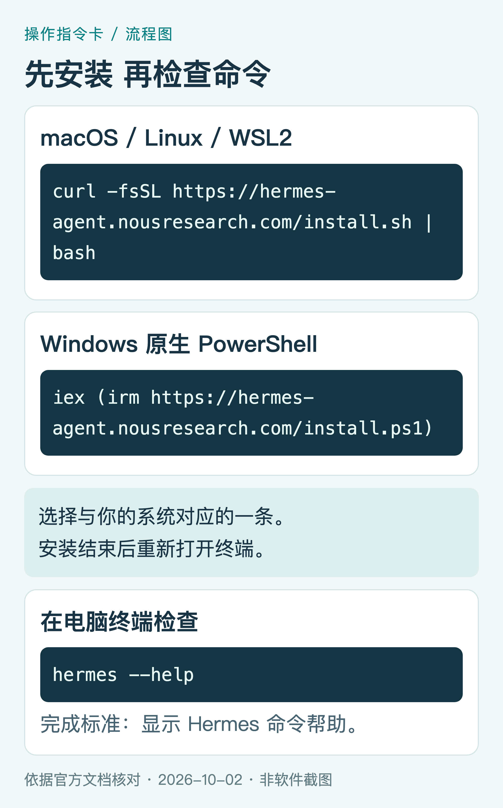

*图3｜安装指令卡。按系统选一条，从正文复制完整命令。*

macOS、Linux 或 WSL2，在电脑终端输入：

```bash
curl -fsSL https://hermes-agent.nousresearch.com/install.sh | bash
```

Windows 原生 PowerShell 输入：

```powershell
iex (irm https://hermes-agent.nousresearch.com/install.ps1)
```

按官方脚本提示安装，结束后重新打开终端，输入：

```text
hermes --help
```

**完成标准：显示 Hermes 命令帮助。** 出现“command not found”或“不被识别”，按[官方安装指南](https://hermes-agent.nousresearch.com/docs/getting-started/installation/)检查安装与 PATH。

## 04 配置模型、工具和文件位置

### 先让模型正常回答

在电脑终端输入：

```text
hermes setup
```

按向导选择服务、认证和模型；已有配置只切换模型时用 `hermes model`。API Key 填在配置环节，不粘贴到论文任务里。不同服务的账号和 Key 不能互换，聊天会员也不自动代表有 API 权限。

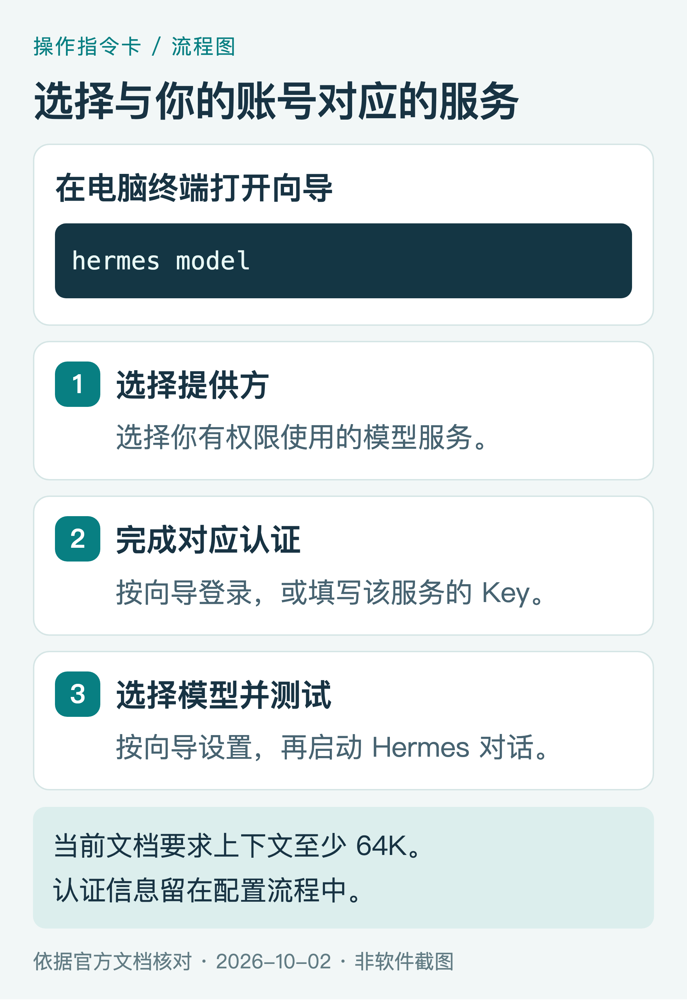

*图4｜配置指引，非软件截图。菜单以当前向导为准。*

当前官方快速入门要求模型上下文至少 **64K tokens**，自建模型尤其要确认。配置好后启动 Hermes，发送“请仅回复：准备好了”；能正常回答再检查工具。[官方快速入门](https://hermes-agent.nousresearch.com/docs/getting-started/quickstart/)

### 再确认搜索、读取和保存能力

在电脑终端输入：

```text
hermes tools
```

为本文的 CLI 平台配置网页搜索、内容提取、终端和文件工具；需要点击或动态页面时再配置浏览器。搜索返回链接、提取读到题录、文件实际保存，是三个不同结果。

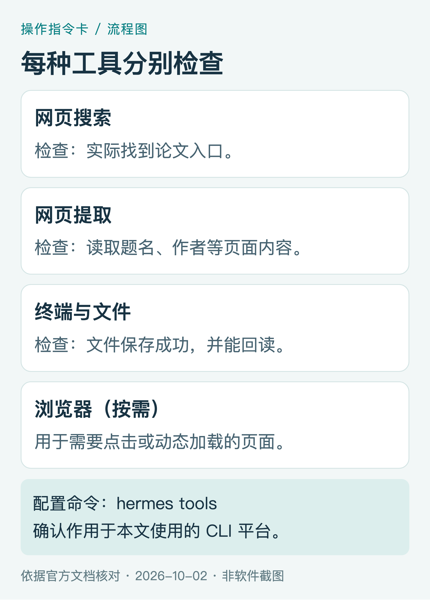

*图5｜工具能力图，非软件截图。逐项确认实际能力。*

网页配置中的 **Web Search & Extract** 可以提供搜索和提取。出现“search-only backend”，按向导增加提取服务。部分路线无需单独密钥，仍可能限流。[网页工具配置](https://hermes-agent.nousresearch.com/docs/user-guide/features/web-search/)

### 最后在专用文件夹启动

本教程采用 **local 本机后端**。在 `hermes setup terminal` 核对；新建练习环境要明确使用本机时，可依次运行：

```text
hermes config set terminal.backend local
hermes config set terminal.cwd .
```

这两条会改变后端与工作目录设置。local 以你的账号权限执行，专用文件夹用于整理，不是权限隔离；已有容器或远程环境应按实际环境取回文件。[工作目录说明](https://hermes-agent.nousresearch.com/docs/user-guide/configuration/#working-directory)

macOS、Linux 或 WSL2，依次输入：

```bash
mkdir -p ~/Documents/literature_demo
cd ~/Documents/literature_demo
hermes
```

Windows PowerShell，依次输入：

```powershell
New-Item -ItemType Directory -Force -Path "$HOME\Documents\literature_demo"
Set-Location "$HOME\Documents\literature_demo"
hermes
```

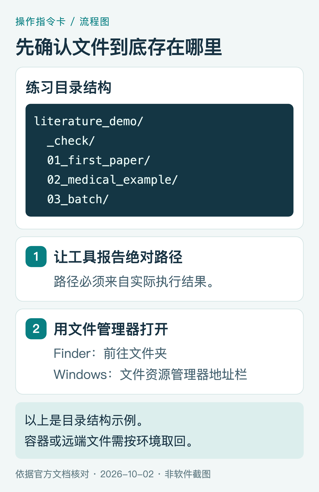

*图6｜路径指引，非软件截图。后面的练习子文件夹都位于实际工作目录内。*

**完成标准：进入 Hermes 对话并能正常回答。** 记下后面环境检查返回的绝对路径。Mac 在 Finder“前往文件夹”中粘贴路径；Windows 在资源管理器地址栏粘贴路径。远端路径需从对应环境取回。

## 05 先做一次环境检查

**复制给 Hermes：**

> 请执行下载前检查，先不要下载论文。  
> 1. 实际调用终端，报告当前工作目录、操作系统和运行后端；无法确认的信息明确说明。  
> 2. 在当前工作目录新建 _check，写入 hello.txt，内容为 hermes-literature-check，再读取核对。只操作本次新建文件夹。  
> 3. 使用网页搜索查找 arXiv:1706.03762，打开实际找到的官方记录页，核对题名。  
> 4. 返回使用的工具、各项结果、错误摘要和测试文件绝对路径；不要输出密钥。任一项失败，先处理，不进入批量任务。

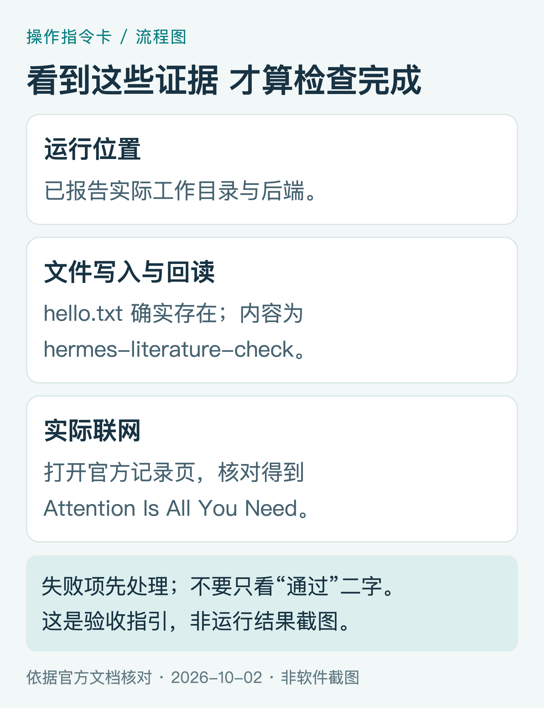

*图7｜验收对照图，不是 Hermes 已运行的结果截图。*

你应找到三项证据：实际目录；hello.txt 的写入与回读；实际访问的记录页和题名。本机还应能打开 `_check/hello.txt`。只有“检查通过”四个字时，要求补齐证据。能聊天却没有工具记录，回到 `hermes tools` 检查当前平台。

## 06 下载第一篇，再自己打开验收

练习文献：**Attention Is All You Need**，arXiv **1706.03762**。打开[官方记录页](https://arxiv.org/abs/1706.03762)，先核对题名和编号，再看 View PDF 入口；记录实际取得的版本。

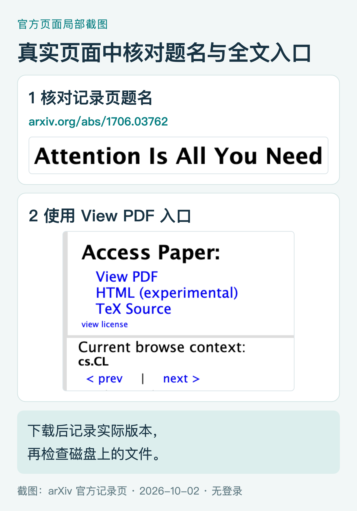

*图8｜arXiv 官方页面局部真实截图，2026 年 10 月 2 日匿名截取。中文标签为引导；页面布局可能变化。*

**复制给 Hermes：**

> 请获取 arXiv:1706.03762，题名应为 Attention Is All You Need。  
> 1. 从官方记录页核对题名、作者、年份及当前可下载版本，使用页面实际 PDF 入口。  
> 2. 在当前工作目录新建 01_first_paper，实际保存 PDF；请求设超时，每个来源最多重试两次，不覆盖已有文件。  
> 3. 核验文件类型、能否打开、页数和首页题名；扩展名或请求成功不能单独证明下载正确。  
> 4. 创建 manifest.csv，记录 title、year、doi、arxiv_id、source_url、version、file_path、status、checked_at、note。未核实字段留空并说明。  
> 5. 只有核验通过才记 downloaded_verified；失败记 download_failed 或 verify_failed 并保留原因。返回文件绝对路径、页数、来源、版本及状态。

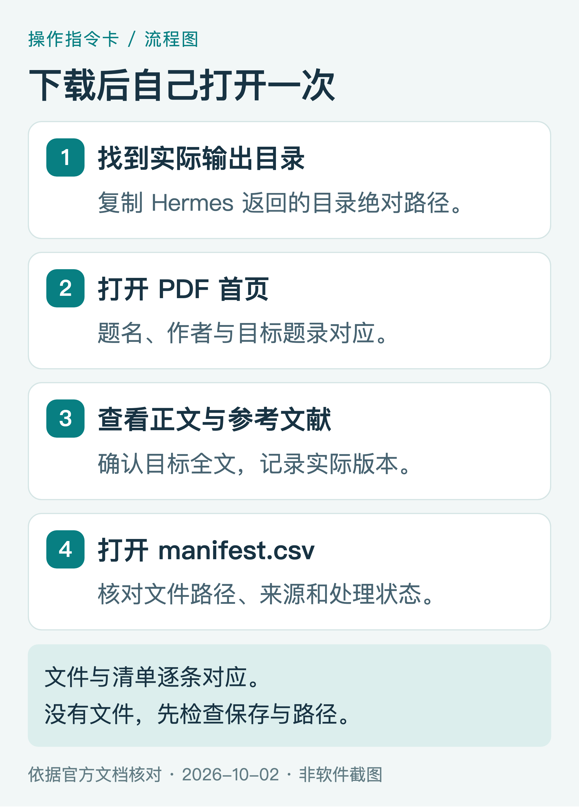

*图9｜文件验收指引，非实际下载结果。*

在实际输出目录找到 PDF，打开首页核对题名和作者，再看正文与参考文献；最后打开 manifest.csv，对照路径、来源和版本。**文件与清单应互相对应。** 只返回链接时，追加：“请把全文实际保存到文件夹并核验；失败则说明原因和下一步。”

## 07 医学文献：题录与全文分开获取

PubMed 提供题录、摘要和全文链接；全文通常来自 PMC、期刊或其他提供方。**PubMed 记录页不能当作全文 PDF。**[PubMed 全文说明](https://pubmed.ncbi.nlm.nih.gov/help/#finding-the-full-text-article)

练习例：**Aplastic Anemia**，Neal S. Young，2018；PMID **30354958**，DOI **10.1056/NEJMra1413485**，PMCID **PMC6467577**。[示例题录](https://pubmed.ncbi.nlm.nih.gov/30354958/)

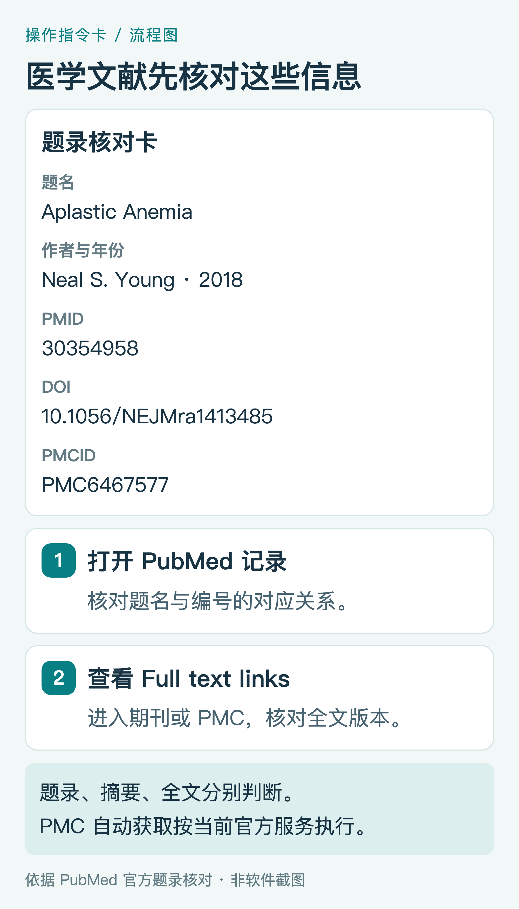

*图10｜依据 PubMed 官方记录制作的题录卡，非软件截图。手动查看 Full text links，再核对全文版本。*

**复制给 Hermes：**

> 请处理 PMID:30354958，题名应为 Aplastic Anemia。  
> 1. 在 PubMed 核对题名、作者、年份、DOI 和 PMCID，确认与输入对应。  
> 2. 查找合法全文，核对期刊官网和公开仓储；注明发表版、作者接受稿或其他版本。  
> 3. 从 PMC 自动获取时，先查当前开发者及 Article Datasets 文档，使用允许的服务；不要循环抓取网页或沿用停用的旧 OA Web Service。  
> 4. 新建 02_medical_example，能取得 PDF 就保存核验；只有 HTML、XML 或 TXT 全文时保留真实格式，记 fulltext_other。  
> 5. 将题录、来源、版本、路径、时间和状态写入 manifest.csv；不能取得时记录 needs_access、not_found 或 download_failed 及下一步。不得用摘要替代全文。

**PMC 的旧分发路线已调整。** 2026 年 8 月完成 Article Dataset 调整，旧版数据文件已移除。自动获取参考当前允许的 Cloud Service、OAI-PMH、E-Utilities、BioC 等服务；需要 PDF 时核对 Cloud 数据集是否提供该文件，并非每篇都有 PDF。[PMC 数据集](https://pmc.ncbi.nlm.nih.gov/tools/textmining/)、[开发者说明](https://pmc.ncbi.nlm.nih.gov/tools/developers/)、[Cloud Service](https://pmc.ncbi.nlm.nih.gov/tools/cloud/)

有 DOI 可用 [Unpaywall](https://unpaywall.org/data-format) 查开放位置和版本，PDF 链接可能为空。订阅文献使用医院或学校正式入口；需要人工获取的项目留在清单中。

## 08 用 CSV 练习去重和小批下载

Excel 新建 `title`、`doi`、`pmid` 三列，每行一篇，空字段留空，保存为“CSV UTF-8”。不合并单元格；题名有英文逗号需正确使用 CSV 引号。初次直接用素材包的 `papers.csv`，放入工作目录即可。

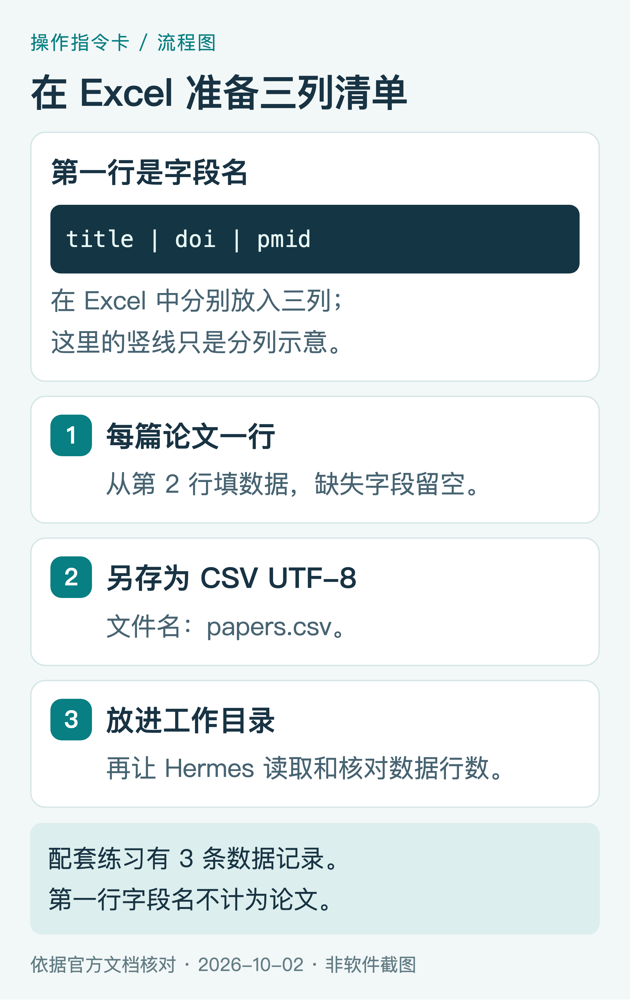

*图11｜CSV 准备指引，非 Excel 截图。字段标题不计为论文。*

练习文件内容如下，三条数据对应两篇文献：

```csv
title,doi,pmid
Attention Is All You Need,10.48550/arXiv.1706.03762,
Aplastic Anemia,,30354958
Aplastic Anemia,10.1056/NEJMra1413485,
```

**先检查，不下载：**

> 请读取当前工作目录的 papers.csv，先不要下载。检查字段、数据行数和空值；规范化 DOI，按 DOI、PMID 与实际题录对应关系去重。仅题名相似的项目不能直接合并。输出 input_checked.csv，保留每条输入行号、处理结果和核对依据；不要补造编号。返回原始行数、重复映射、唯一文献数及待确认项。

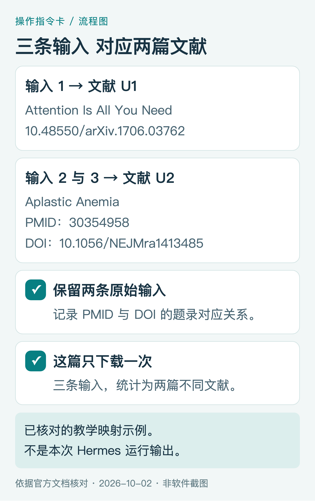

*图12｜教学映射，非 Hermes 运行结果。第 2、3 条使用不同编号，实际指向同一篇 Aplastic Anemia。*

示例应得到**三条输入、两篇不同文献**；重复输入保留映射，下载时只处理一次。题名相似或预印本与发表版关系未确认时，保留待核对。

**再处理第一小批：**

> 请按已核对清单获取全文，本次最多五篇不同文献。逐篇确认身份、找来源、下载并核验，串行执行；限流按要求等待，每个来源最多重试两次。PMC 使用当前允许服务。新建 03_batch/pdf、03_batch/fulltext_other 和 03_batch/metadata，避免覆盖文件。每处理一篇更新 metadata/manifest.csv，记录输入行号、题名、DOI、PMID、来源、版本、路径、状态、原因和时间；失败也保留。保存 README.txt，返回输入数、唯一文献数、各状态数量与清单路径，不扩展范围。

打开本批文件和清单，确认无误配、覆盖或版本混乱，再增加数量。其他格式全文单独统计，不计为已核验 PDF。

## 09 只有研究主题，先生成候选清单

先限定对象、主题、年份和数量。下面用于检索练习，不代表完整系统综述策略。

**复制给 Hermes：**

> 请查找获得性再生障碍性贫血与造血干细胞移植文献，范围 2021-01-01 至 2026-10-02。先不下载；提出 PubMed 检索式，解释关键词、字段、日期及如何区分获得性疾病与遗传性骨髓衰竭。实际检索后列十篇候选，记录题名、作者、年份、研究类型、DOI、PMID、题录链接、全文状态和入选原因。报告实际检索式、日期、排序和结果范围，不声称十篇覆盖全部证据；摘要可确认的内容与需阅读全文确认的内容分开，不推断缺失信息。

你选定后，再让它仅获取选中的文献，沿用保存与核验要求。下载完成不等于完成质量评价或临床证据分析。

## 10 核验全文，记录状态与版本

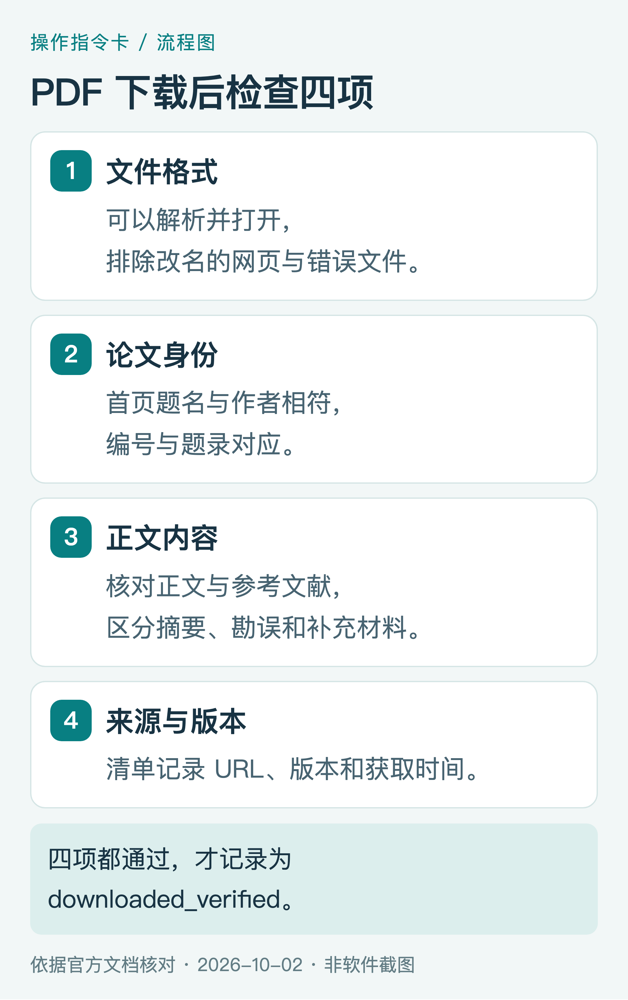

*图13｜核验清单。格式、身份、全文与版本分别检查。*

让工具解析 PDF，同时由你打开；看首页题名与作者、正文和参考文献。能解析的 PDF 也可能只是提示页，页数本身不能证明完整。

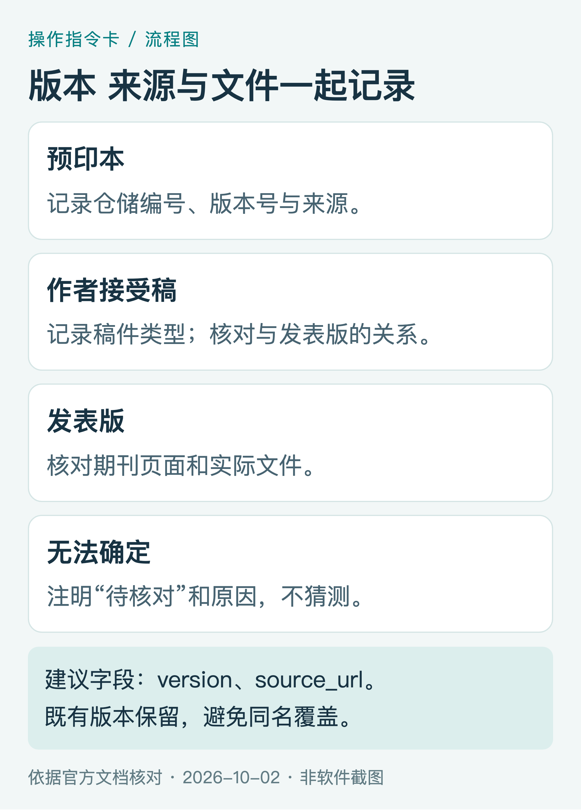

*图14｜版本指引，非软件截图。同一研究可以有多个版本。*

记录 `version`、`source_url` 和获取时间；arXiv 保留实际版本号，仓储注明作者接受稿，无法确认写待核对。文件可按 `YYYY_Author_ShortTitle_Version.pdf` 命名，重名时保留原文件。

以下状态是本文约定，并非 Hermes 内置固定输出：

| 状态 | 含义 |
| --- | --- |
| downloaded_verified | PDF 已保存且通过核验 |
| fulltext_other | 已取得其他格式全文 |
| needs_access | 需要订阅、登录或人工获取 |
| not_found | 本次未找到合适全文入口 |
| download_failed | 全文获取或保存失败 |
| verify_failed | 文件格式、身份或内容未通过 |

配套 `manifest-template.csv` 只有字段标题，是空白模板；`input-checked-example.csv` 是教学映射，都不是已下载成果。

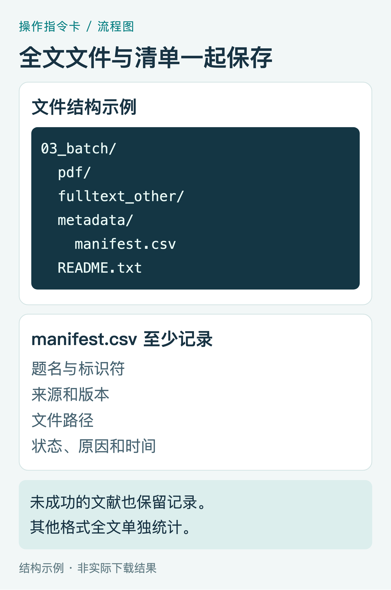

*图15｜建议目录结构，非实际执行结果。*

**收尾核对：**

> 请逐条核对 manifest.csv 与实际文件，找出缺文件、缺记录、重复文件及 verify_failed 项目，不删除或覆盖。生成检查报告，分别统计原始输入、唯一文献、已处理和未处理数；downloaded_verified 与 fulltext_other 分开。列出需人工打开、取得权限或确认版本的项目。

## 11 按失败环节排查，再续做

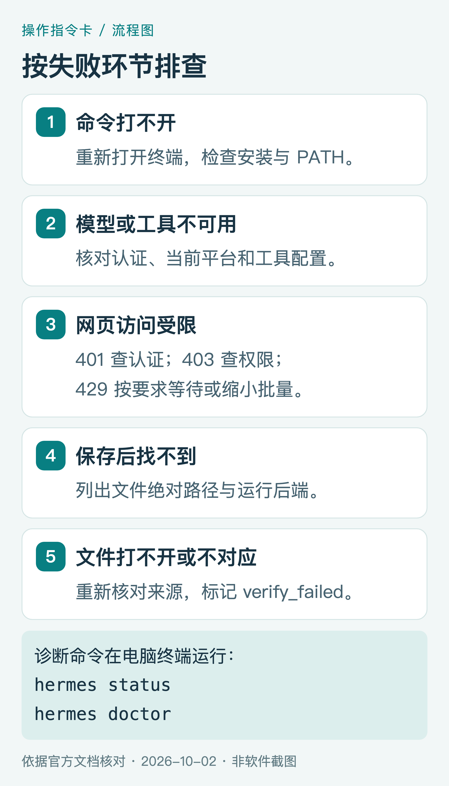

*图16｜排错指令卡，非软件截图。先找失败环节，再处理未完成项。*

命令打不开查安装与 PATH；能聊天不执行查当前平台工具；能搜索不提取查服务能力；说已保存却找不到，重新列绝对路径与后端。401 核对认证，403 核对权限和来源，429 按提示等待或缩小批量；PDF 内容不对标记 verify_failed。

另开电脑终端检查状态：

```text
hermes status
hermes doctor
```

用 `hermes --continue` 可恢复最近会话，继续任务仍要依据磁盘清单。[诊断命令](https://hermes-agent.nousresearch.com/docs/reference/cli-commands/)、[恢复说明](https://hermes-agent.nousresearch.com/docs/getting-started/quickstart/#4-verify-sessions-work)

**续做提示词：**

> 请读取现有 manifest.csv 和文件，核对 downloaded_verified 项目仍在，不重复下载。列出待办，只继续我指定的 download_failed 和 not_found；verify_failed 先排查，needs_access 留为人工待办。保留已有文件和记录，追加本次时间、来源及结果并更新状态。

**需要报错帮助时：**

> 任务停在〔阶段〕，实际错误为〔摘要〕，工具为〔名称〕，文献编号为〔编号〕，目录为〔路径〕。请先检查失败环节，区分已确认原因与待验证项，给出下一步最小操作；暂不扩展批量。以上内容已遮去密钥与登录令牌。

## 12 跑通一篇，再带入自己的课题

第一次只需完成：**命令可用、工具实际执行、全文能打开、清单可对应。** 再用三条 CSV 记录练习去重，最后换成自己的课题。来源、版本和失败原因保留完整，后续补全文和整理引用更方便。

*核验说明：命令与功能依据官方文档核对；图8为真实页面局部截图，其余为指令卡或流程图。本教程未在本机执行 Hermes 论文下载，任务模板的结果需在读者环境验收。*

*发表与分享：文章可以分享获取方法和题录链接；转发论文原文前核对许可。公众号导入、补图和手机预览步骤见配套发表指南。*
