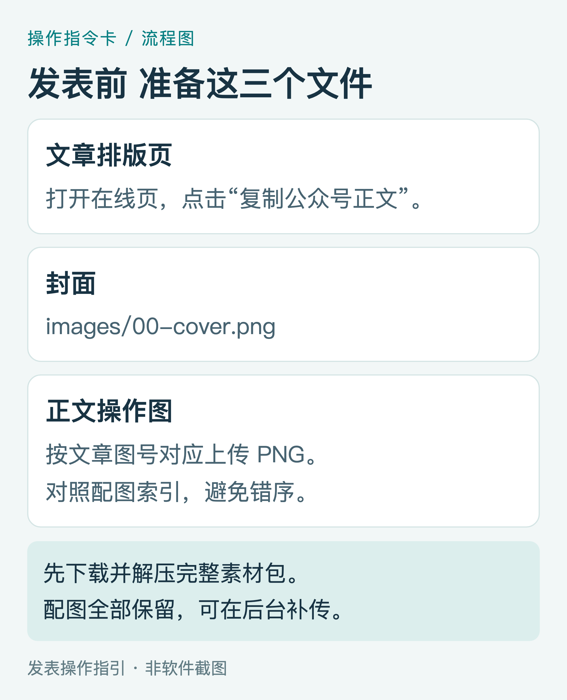
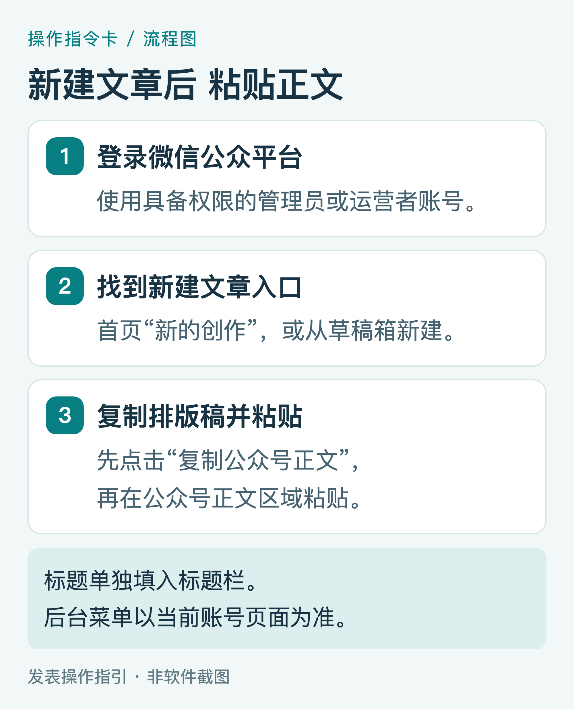
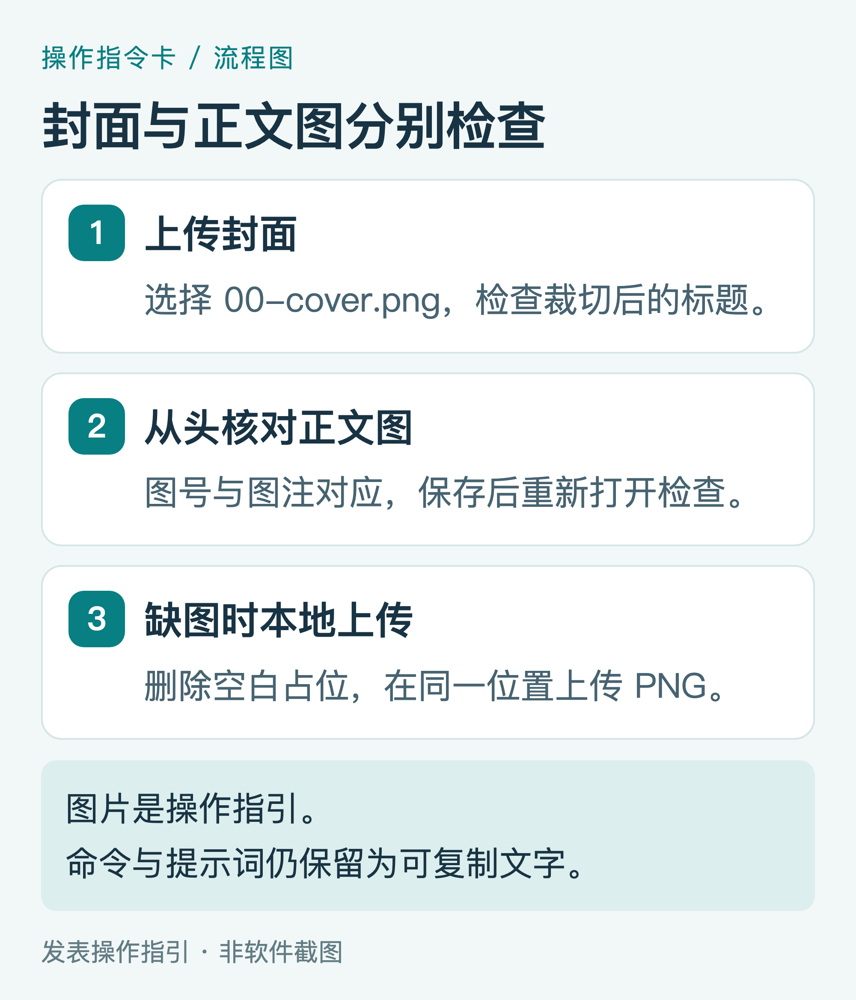
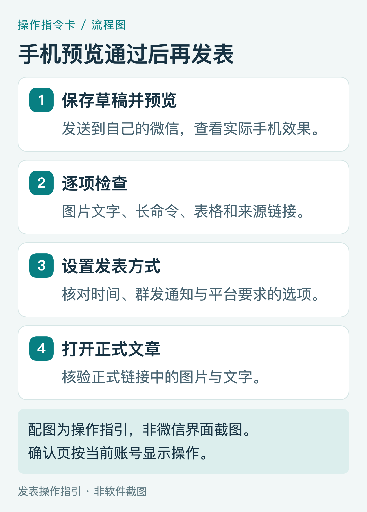

# 把这篇 Hermes 教程发布到微信公众号：配图操作指南

这份指南面向发表文章的操作者。文章正文讲 Hermes 下载文献，下面讲如何把已排好的文章放进公众号后台。建议使用电脑操作，手机用于最后预览。

所有配图都是操作指引，菜单名称以当前公众号后台为准。本文没有登录你的公众号或执行发表。

## 1 准备正文、封面和操作图

下载完整素材包后解压。打开“公众号发表素材包”文件夹，先找到内嵌图片的 `Hermes文献下载_公众号排版稿.html`，用 Chrome 或 Edge 打开；也可以直接打开在线阅读页。

*图P1｜材料准备指引，非软件截图。*

页面顶部有“复制公众号正文”按钮。点击后按页面提示核对；浏览器如询问剪贴板权限，按你希望执行的复制操作处理。离线页面如果复制按钮没有成功，可选中文章正文复制，或者从可编辑 Word 稿复制。

同时打开 `images` 文件夹。`00-cover.png` 用于封面；正文图的文件名与阅读顺序不完全相同，请使用配套的“配图索引.csv”核对文章图号和文件名。所有 PNG 均为高清素材，不需要从 PDF 截图取图。

## 2 登录后台，新建文章

打开 [微信公众平台](https://mp.weixin.qq.com/)，使用有权限的管理员或运营者微信扫码登录。找到首页“新的创作 → 文章”，或从“草稿箱”新建文章。不同账号和后台版本可能显示不同名称，选择能进入图文正文编辑器的入口。

*图P2｜编辑顺序指引，非微信后台截图。*

先在排版页点击“复制公众号正文”，再回到公众号编辑器，点击正文区域并粘贴。Windows 使用 Ctrl+V，Mac 使用 ⌘V。保留文字和基本排版后，重点检查命令块、提示词、表格和来源链接。复制排版稿后粘贴到公众号正文，是常见的导入路线。[复制到公众号的操作参考](https://bj.96weixin.com/help/?id=39)

标题填写在公众号标题栏。如果粘贴后的正文顶部也出现同一个完整标题，可删除正文中的重复标题，保留开篇段落和封面图。

## 3 填写标题、作者、摘要与封面

建议标题：**用 Hermes Agent 下载研究文献：从第一篇 PDF 到文献库**。

建议摘要：**从打开终端、配置模型和工具开始，完成单篇下载、医学全文获取、清单去重与核验归档。附高清操作图、提示词和练习清单。**

作者填写你希望公开显示的署名。封面上传 `00-cover.png`，在编辑器裁切预览中调整位置，确保“用 Hermes Agent 下载研究文献”的标题完整。封面为 2000 × 850 像素，正文操作图不应裁掉命令或图注。

*图P3｜上传和补图指引，非微信后台截图。*

从文章开头逐张核对图片。图片空白、显示失败或保存后消失时，删除该图片的占位内容，通过编辑器的本地图片上传功能，在对应图注前重新插入 PNG。正文的图1至图16按“配图索引.csv”对应；不要只按文件名编号排序。

如果后台提供“阅读原文”字段，可以填入在线教程地址，方便读者复制长命令和下载资料。正文中的外链是否可点击，取决于当前编辑器处理和账号权限，预览时逐条测试。不能保留的链接，可在文末保留来源名称和完整网址供复制。

## 4 保存草稿，发送手机预览

保存后退出编辑器，再打开草稿，确认图片仍在。使用预览功能发给自己的微信，在手机中从头阅读一次。

*图P4｜发表前核对指引，非实际发表截图。*

重点检查四项：操作图文字能否看清；命令中的网址、引号与符号是否完整；提示词和表格是否有正确换行；来源链接与阅读原文是否可用。图片可以帮助理解，但命令和提示词保留为正文文字，让读者能复制。

手机显示拥挤时，先调段落间距或表格宽度；长命令应保留完整内容，允许视觉换行，避免在命令本身新增空格、手动断开网址或删除符号。

## 5 确认发表选项，并核验正式链接

在后台找到“发表”或当前版本的对应入口，核对发表时间、是否群发通知，以及平台要求填写的其他选项。如果希望推送给关注者，使用页面提供的群发通知设置；只公开文章时，按页面选项处理。确认页可能要求管理员扫码。[发表通知配置参考](https://www.wefeather.cn/guide/mp-platform-publish)

发表后，在发表记录中打开正式文章。确认正式链接、图片、文字和阅读原文正常，再分享文章链接。用于测试的预览链接与正式文章链接应分别核对。

## 配套文件怎样使用

手机阅读可打开 `Hermes文献下载_手机阅读版.html`，它内嵌图片，支持目录跳转和点击放大。`Hermes文献下载_手机阅读版.epub` 可导入支持 EPUB 的阅读器，按设备设置字体和行距；正文、图号与精简发表稿一致。手机浏览器复制功能依赖系统支持，不可用时长按选中文字。

Markdown：完整文字和图片引用，可继续修改。Word：正文、标题、提示词和链接可编辑。PDF：用于阅读和核对版面。单文件 HTML：内嵌图片，适合离线查看与复制。PNG：用于公众号上传。figures 中的 HTML/CSS：用于修改图稿文字和版式后重新导出。

`papers.csv` 是三行数据、两篇文献的练习输入；`input-checked-example.csv` 是已核对的教学映射示例，非实际执行结果；`manifest-template.csv` 是空白字段模板。请不要把这些练习文件描述为已下载的论文成果。

文中 arXiv 图使用官方页面的真实局部截图，其余图为指令卡或流程图，已在图注说明。发表时保留类型说明和来源，便于读者理解。
